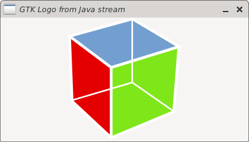

[](https://github.com/bailuk/java-gtk/actions/workflows/build-on-debian.yml)
[](https://github.com/bailuk/java-gtk/actions/workflows/build-on-fedora.yml)
[](https://jitpack.io/#bailuk/java-gtk)

# Java-GTK
Experimental GTK 4 bindings for Java.
It uses [Java Native Access (JNA)](https://github.com/java-native-access/jna) to access GTK libraries. 

[](examples/src/main/java/examples/ImageBridge.java)

## Example
```java
package examples;

import ch.bailu.gtk.gio.ApplicationFlags;
import ch.bailu.gtk.gtk.Application;
import ch.bailu.gtk.gtk.ApplicationWindow;
import ch.bailu.gtk.gtk.Button;
import ch.bailu.gtk.type.Str;
import ch.bailu.gtk.type.Strs;

public class HelloWorld {
    public static void main(String[] args) {
        new HelloWorld(args);
    }

    public HelloWorld(String[] args) {
        var app = new Application(new Str("com.example.GtkApplication"),
            ApplicationFlags.FLAGS_NONE);

        app.onActivate(() -> {
            
            // Create a new window
            var window = new ApplicationWindow(app);

            // Create a new button
            var button = Button.newWithLabelButton(new Str("Hello, World!"));

            // When the button is clicked, close the window
            button.onClicked(() -> window.close());
            window.setChild(button);
            window.show();
        });

        app.run(args.length, new Strs(args));
    }
}
```

## Build
`make gen`  
Compiles and runs the code generator. This will generate Java code from [GIR](https://gi.readthedocs.io/en/latest/) files.
- Input: `generator/src/resources/gir/*`
- Output Java: `java-gtk/build/generated/src/main/java/[...]/*.java`
- Configuration: [generator/src/main/kotlin/ch/bailu/gtk/Configuration.kt](generator/src/main/kotlin/ch/bailu/gtk/Configuration.kt)

`make`  
Creates library, javadoc and run tests
- Output: jar, javadoc.jar and sources.jar in `libray/build/libs/` 

`make run`  
Run the default demo application.
The default demo application can be selected in [examples/src/main/java/examples/App.java](examples/src/main/java/examples/App.java)

`make install`  
Compile Java library, generate JAR archive and copy JAR archive as artifact to local Maven repository (`~/.m2/repository`).

## Integration
Library and [Javadoc](https://javadoc.jitpack.io/com/github/bailuk/java-gtk/0.1/javadoc/) is available via [JitPack](https://jitpack.io).

```kotlin
// build.gradle.kts
plugins {
    application
}

repositories {
    maven { url = uri("https://jitpack.io") }
}

dependencies {
    implementation("com.github.bailuk:java-gtk:0.1")
}

application {
    mainClass.set("examples.HelloWorld")
}
```

## Modules
- `generator/`: Kotlin application that generates Java code from GIR files (xml parser -> model builder -> writer). GIR files are taken from Debian dev packages.
- `java-gtk/` : java-gtk library depends on generated Java code.
- `examples/` : Some examples to test the bindings. Mostly ported from [https://gitlab.gnome.org/GNOME/gtk/-/tree/main/demos/gtk-demo](https://gitlab.gnome.org/GNOME/gtk/-/tree/main/demos/gtk-demo).
 
## License
- Files in [generator/src/resources/gir/](generator/src/resources/gir/) are comming from the [GTK project](https://gitlab.gnome.org/GNOME/gtk) and are therefore licensed under the GNU Library General Public License.
- Examples in [examples/src/main/java/examples/gtk3_demo](examples/src/main/java/examples/gtk3_demo) are ported from the [GTK project](https://gitlab.gnome.org/GNOME/gtk/-/tree/main/demos/gtk-demo) and are therefore licensed under the GNU Library General Public License.   
- Everything else licensed under the [MIT License](https://en.wikipedia.org/wiki/MIT_License)
